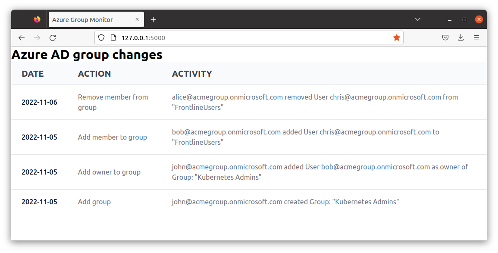
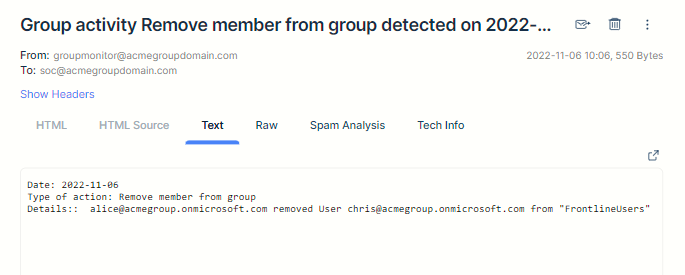

# Azure Group Monitor 

Azure Group Monitor is a simple tool for Administrators who would like to monitor changes to groups in Azure and receive email alerts. This is quite useful for monitoring groups that give users privileged access. 

At the moment, the tool monitors the following changes to Azure groups if the action is done by a user: 

✅ creating a group 

✅ adding a member to a group 

✅ adding an owner to a group

✅ removing a member from a group 


When one of the above actions occurs, an email is sent to the address configured in the system. 





## Installation and configuration
A detailed step-by-step installation and configuration guide is available [here](docs/Installation%20and%20configuration.md)

## Usage 
You can run the application using the following command:
```
path/to/directory$ ./start.sh 
```
The application will be available on http://localhost:5000/

To stop the application, do a CTRL+C in the terminal. 


## License 

Azure Group Monitor is an open-source software available under the MIT license.


